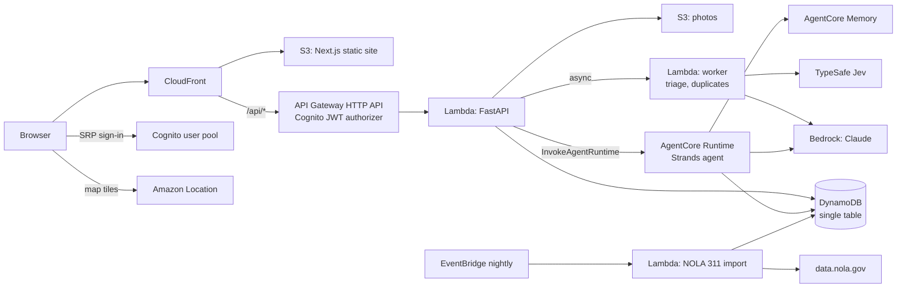

# Rapport

Report potholes, street damage and clogged catch basins in New Orleans, and follow them through to the City's fix.

Rapport mirrors the NOLA 311 service request form (Roads and Streets, Drainage). Behind the three-step report flow, AI does the paperwork: it reads your photo to suggest the category, checks whether a neighbor already reported the same spot, and writes a description the City can act on. Every night it reads the City's public 311 data to update the status of reports residents have filed.

**Live:** https://dgin5b0sb30n0.cloudfront.net

## What it does

- **Report in three steps**: request type, contact info (prefilled from your profile), then location (GPS, photo GPS, address or intersection search, or a pin), up to three photos and a description.
- **Photo triage**: Claude on Amazon Bedrock describes the photo; TypeSafe Jev turns that into a category suggestion with a probability, a severity score and a safety flag. Photos showing people or license plates stay private.
- **Duplicates**: open reports of the same type within 75 m are compared with Jev ("same physical problem?"), and you can +1 an existing report instead of filing a duplicate.
- **Already reported to the City?** Before submitting, Rapport checks the City's 311 data, including a live query, for an open request for the same problem within 150 m, and offers to link your report to it instead.
- **NOLA 311 hand-off and status sync**: copy a City-ready summary into NOLA 311, save the request number, and the nightly import moves your report to *filed*, *in progress* or *resolved* from the City's data. Rapport also suggests the City request that matches a report you forgot to link.
- **Ask Rapport**: a chat assistant (Strands agent on Amazon Bedrock AgentCore) that drafts a report from a sentence ("the catch basin in front of 1300 Perdido is clogged") and checks on your reports. It drafts only; you review and submit.
- **Public map and impact numbers**: an anonymous live map of open reports, optional City 311 and catch basin layers, and a "why catch basins matter" section computed nightly from City data (open drainage requests per 100 catch basins by neighborhood, median days to close, the Hurricane Francine surge).

## Architecture



More detail, including the request flows and the data model, is in [docs/architecture.md](docs/architecture.md).

| Path | What |
|---|---|
| `web/` | Next.js (App Router, static export) with Bun, Tailwind, MapLibre |
| `api/` | FastAPI on Lambda; `app/services/` is shared by the API, the worker, the nightly import and the agent |
| `agent/` | Strands agent for AgentCore Runtime (direct code deployment) |
| `infra/` | Terraform: `bootstrap` (state, CI roles), `modules/{data,auth,api,agent,maps,web}`, `envs/{prod,local}` |
| `scripts/` | Packaging, local environment, seed and cleanup scripts |

## Local development

Requirements: Docker, [Bun](https://bun.sh), [uv](https://docs.astral.sh/uv/), Terraform 1.10 or later.

```sh
make env          # web/.env.local + api/.env with Cognito and map settings (needs AWS credentials)
make local-up     # MiniStack on :4566 + table and bucket from the Terraform data module + sample data
make api          # FastAPI on http://localhost:8000 (docs at /api/docs)
make web          # Next.js on http://localhost:3000
make agent        # optional: the chat agent on :8080 (run the API with RAPPORT_AGENT_MODE=http)
```

Locally the site signs in against the real Cognito user pool, and data stays in MiniStack. AI, geocoding and City data default to deterministic fakes (`RAPPORT_AI_MODE`, `RAPPORT_GEO_MODE`, `RAPPORT_NOLA311_MODE` = `fake`); set them to `live` to use Bedrock, TypeSafe, Amazon Location and data.nola.gov with your AWS credentials.

- **MiniStack** ([ministack.org](https://ministack.org)) emulates DynamoDB, S3 and friends. `make local-infra` resets it and re-applies `infra/envs/local`.
- **NoSQL Workbench for DynamoDB**: import `docs/dynamodb/rapport.workbench.json` to explore the single-table design, or connect it to `localhost:4566` to browse local data.
- **Sample data**: `uv run --with boto3 scripts/seed-demo.py local --owner <sub>` creates labeled sample reports; `--remove` deletes them.

API routes are signed-in by default: API Gateway's JWT authorizer guards `ANY /api/{proxy+}`, and the few public routes (health, map, stats, catalog, docs) are listed explicitly in `infra/modules/api`.

## Checks

```sh
make lint         # Ruff, Biome, tsc, terraform fmt
make test         # pytest (API, agent) + bun test
make e2e          # Playwright against BASE_URL (default http://localhost:3000)
```

Signed-in Playwright tests use the `e2e@example.com` user (`E2E_EMAIL`, and `E2E_PASSWORD` from SSM `/rapport/prod/e2e/password`). `scripts/cleanup-e2e.py <env>` removes what that user created.

## Delivery

Every pull request runs CI (lint, tests, package builds) and posts a read-only Terraform plan. Merging to `main` deploys to production: Terraform apply (refusing any plan that deletes or replaces a resource), the incremental NOLA 311 import, sample data, the web build and upload, a smoke test, Playwright against production, and cleanup of the test data.

## Data

City data comes from [data.nola.gov](https://data.nola.gov): 311 calls for service (`2jgv-pqrq`), catch basins (`se4p-ierc`) and neighborhoods (`exvn-jeh2`). Reports on the public map are anonymous: no names, contact details or typed addresses, and locations rounded to about 10 m.
