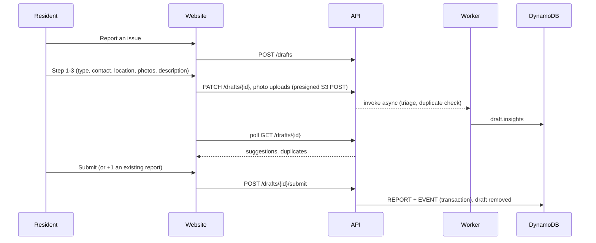
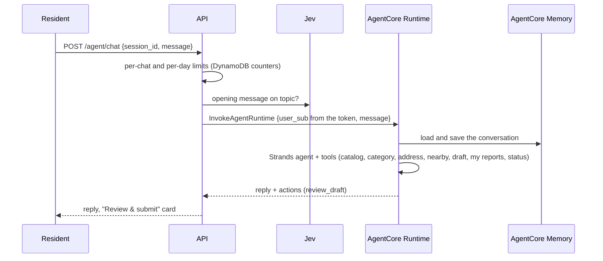

# Architecture

Rapport is a static Next.js site and a FastAPI backend on AWS Lambda, with AI work split between an asynchronous worker (photo triage, duplicate checks) and a chat agent on Amazon Bedrock AgentCore. All infrastructure is Terraform in `infra/`; production is `infra/envs/prod`.

## Components

| Component | AWS | Code |
|---|---|---|
| Website | S3 + CloudFront (static export; `/api/*` routed to API Gateway) | `web/` |
| Sign-in | Cognito user pool, SRP from the site's own pages | `infra/modules/auth`, `web/src/app/sign-*` |
| API | API Gateway HTTP API (Cognito JWT authorizer) + Lambda (FastAPI, Mangum), Python 3.12 arm64 | `api/app/routers`, `api/app/main.py` |
| Worker | Lambda, invoked asynchronously by the API, reserved concurrency 5, no retries | `api/app/worker.py` |
| Nightly import | Lambda on an EventBridge schedule (08:00 UTC, about 3 a.m. in New Orleans) | `api/app/services/ingest.py` |
| Chat agent | AgentCore Runtime (direct code deployment, arm64) + AgentCore Memory | `agent/` |
| Data | DynamoDB single table (on-demand, TTL), S3 photo bucket | `infra/modules/data` |
| Maps and search | Amazon Location: map tiles (API key restricted to our origins) and geo-places | `infra/modules/maps`, `api/app/services/geo.py` |
| AI | Claude on Amazon Bedrock; TypeSafe Jev (API key in SSM) | `api/app/services/{vision,jev,triage}.py` |

## Flows

### Reporting a problem

- Drafts live in DynamoDB with a TTL, so abandoned drafts clean themselves up.
- Photos are uploaded straight to S3 with presigned POSTs. The browser reads the photo's GPS for the location and strips EXIF before upload.
- Triage and duplicate checks never block submission: if they fail or are slow, the resident just doesn't see suggestions.

### Photo triage

1. **Claude on Bedrock** (vision) turns the photo into a structured observation: scene description, visible objects, landmarks, image quality, and whether people or license plates are visible. It reports through a tool call validated with Pydantic.
2. **TypeSafe Jev** scores that observation: the most likely request reason out of the eight City categories (or "not a street problem"), severity on a four-level scale, a safety-hazard probability, and whether it matches what the resident picked.
3. The website shows the top suggestions with their probabilities. Nothing is changed without the resident accepting it.

### Duplicates and +1

Open reports of the same type within 75 m and 90 days, found through the geohash index (GSI2), are compared with Jev ("is this the same physical problem?"). Likely matches are offered as "+1 instead", which adds the resident as a supporter (optionally with their photo) rather than creating a second report.

### Already reported to NOLA 311

Before a report is created, submit checks for open City requests for the same problem:

- **Where it looks:** open City requests of the same type within **150 m** from the nightly import, plus a **live query of data.nola.gov**, which catches requests filed since last night.
- **Why 150 m:** the City places a request at its address while residents pin the problem itself, so the two are often 100 m or more apart.
- **What counts as a match:** a request with the same reason always counts. For a related reason, Jev decides. Jev isn't asked about same-reason requests because its "same spot?" answer can't account for the City's address-based placement.
- **What the resident sees:** if there's a match, submit returns 409 and the form offers **Link my report to #…**, which files the report against that request and verifies it, or **It's a different problem**.
- **If the check fails:** if the City's API is down, the check never blocks a report.

### NOLA 311 sync

- **Nightly import:** the import Lambda fetches City requests modified since the last run from `data.nola.gov` (a 24-month backfill the first time) and stores them for the map layer and the stats.
- **Status sync:** a report linked to a City request number (a `TICKET#` pointer) follows the City's status. Closed means *resolved*; still open but updated more than an hour after filing means *in progress*. Each change is recorded as a timeline event from the City.
- **Checking on demand:** when its owner opens a linked report (or taps **Check for updates**), `POST /reports/{id}/refresh` reads that request from data.nola.gov right away and applies the same rules. It runs at most once every 10 minutes per report, and a City outage just shows the last known status.
- **Suggested links:** recent unlinked reports get the closest City request with the same reason within 150 m, filed within 72 hours. The resident confirms or dismisses it.
- **Impact stats:** City numbers are recomputed and stored as `STATS#latest`. Rapport's own counts (reports, +1s, filed with 311, resolved) are computed live on each `GET /stats`, so a new report shows up right away. Sample data and the test account are excluded.

### Ask Rapport (chat)

- The agent acts only for the user id taken from the verified token, never one sent by the browser.
- It can create a draft but cannot submit. "Review & submit" opens the normal report form on the last step.
- Replies are plain text; the API strips any emoji that slips through.

## Data model

One DynamoDB table (`rapport-prod`), keyed `PK`/`SK`, with three global secondary indexes:

| Item | PK | SK | Notes |
|---|---|---|---|
| Profile | `USER#{sub}` | `PROFILE` | Contact info used to prefill reports |
| Draft | `DRAFT#{id}` | `META` | Step data, photos, insights; TTL |
| Report | `REPORT#{id}` | `META` | Type, reason, contact, location, status, AI assessment, basin, 311 link |
| Timeline event | `REPORT#{id}` | `EVENT#{time}#{ulid}` | Source: resident, City, or system |
| +1 | `REPORT#{id}` | `SUPPORT#{sub}` | One per resident |
| City request | `NOLA311#{number}` | `META` | From the nightly import |
| Link pointer | `TICKET#{number}` | `REPORT#{id}` | Lets the sync find linked reports |
| Import state, stats | `INGEST#nola311`, `STATS#latest` | `STATE`, `META` | |

| Index | Key | Used for |
|---|---|---|
| GSI1 | `USER#{sub}` + created time | A resident's dashboard |
| GSI2 | `GEO#{geohash6}` + `TYPE#{type}#{time}` | Nearby reports (duplicates, City matches) |
| GSI3 | `MAP` or `MAP311` + time | Public map and stats |

The model is also in `docs/dynamodb/rapport.workbench.json` for NoSQL Workbench.

## Security and privacy

- **Authorization:** every API route requires a Cognito ID token unless it's listed as public (health, catalog, neighborhoods, map, stats, docs). Owners see their full report; other residents see it without contact details.
- **Public map:** anonymous (no names, contact details or typed addresses), with coordinates rounded to four decimals.
- **Photos:** private by default. They're shown to others only if triage ran and saw no people or license plates.
- **Secrets:** the TypeSafe key lives in SSM Parameter Store (SecureString). No secrets are kept in code or CI variables.
- **CI roles:** GitHub Actions uses OIDC. Pull requests get a read-only plan role; only `main` in the `prod` environment can assume the deploy role, which can manage only `rapport-*` IAM resources.
- **Deploy guard:** the deploy refuses Terraform plans that delete or replace resources unless explicitly allowed.
- **Runtime IAM:** each Lambda and the agent runtime has its own role scoped to what it uses (for example, the worker can only read and update table items and read draft photos).
